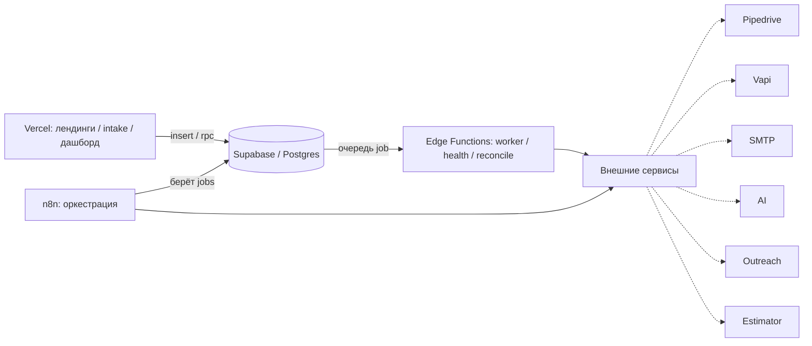

# 🧭 GRC — База знаний

> [!abstract] TL;DR
> Система автоматизации пути лида для сервисного бизнеса (ремонт/восстановление) на рынке США:
> **приём → обогащение → CRM → первое касание → outreach → AI-эстимейт.**
> Ключевая идея — **надёжная инфраструктура, а не happy-path**: идемпотентность, очередь с ретраями, dead-letter, реконсиляция, наблюдаемость. Лид не теряется никогда.

> [!success] Состояние
> 🟢 **Бесплатная база Б1–Б6 собрана, задеплоена и в проде.** Конвейер `intake → enrich → pipedrive_upsert → first_touch(заглушка)` работает: очередь с ретраями, dead-letter, реконсиляция, health-check, дашборд и Telegram-алерты.
> - Репозиторий: [zobnin8-ux/GRC_WORK](https://github.com/zobnin8-ux/GRC_WORK)
> - Supabase: `kuuxaubnbwbwjdttvhom` · Frontend: `grc-work.vercel.app` (`/` → `/dashboard`)
> - Полный handoff: `docs/grc-handoff.md`
> Дальше — платная фаза (Vapi + почта, AI Estimator, outreach).

> [!info] Что в проде (Б1–Б6)
> | | Что | Где |
> |---|---|---|
> | Б1 | intake endpoint | Edge Function `intake` (verify_jwt=false, `X-Intake-Token`) |
> | Б2 | автозапуск воркера | `pg_cron` `run-worker` (1м) → `worker` v7 |
> | Б3 | reconciliation | `reconcile` v3 + cron `run-reconcile` (5м) |
> | Б4 | health-check | `healthcheck` v3 + cron `run-healthcheck` (2м) |
> | Б5 | дашборд | 9 `dash_*` RPC (SECURITY DEFINER) + Next.js на Vercel |
> | Б6 | Telegram-алерты | `lib/alert.ts` в worker/healthcheck/reconcile |

---

## 🗺️ Карта проекта

- [[#🏗️ Архитектура]]
- [[#🔒 Инварианты]]
- [[#🧱 Модель данных]]
- [[#🧩 Модули]]
- [[#🔁 Поток лида]]
- [[#🔌 Интеграция estimator]]
- [[#🚧 План действий]]
- [[#❓ Открытые вопросы]]
- [[#📖 Глоссарий]]

---

## 🏗️ Архитектура

Четыре слоя с чётким разделением ответственности:

| Слой | Роль |
|---|---|
| **Vercel** | веб: дашборд (Next.js 14 App Router, TS). Сейчас — `/dashboard` на anon-ключе через `dash_*` RPC |
| **Supabase / Postgres** | несущая конструкция: состояние, очередь job, аудит, Edge Functions, `pg_cron` + `pg_net`, Vault |
| **n8n** | дирижёр оркестрации — **пока не задействован**; оркестрацию сейчас держат Edge Functions + `pg_cron` |
| **Внешние** | Pipedrive (live), Telegram (live); Vapi, SMTP, OpenAI/Anthropic, Instantly/Smartlead — платная фаза |

> [!note]
> Каждый шаг конвейера — атомарный **job** в очереди Supabase. Edge Functions только *исполняют* jobs; правда о состоянии — всегда в БД. На текущем этапе всё работает без n8n: воркер дёргается `pg_cron` каждую минуту.



---

## 🔒 Инварианты

> [!danger] Нарушать нельзя
> 1. Состояние — в **Supabase**, не в n8n и не во фронте.
> 2. Каждая внешняя операция **идемпотентна** (детерминированный ключ → нет дублей).
> 3. **Отказ — норма**: ретраи с экспоненциальным backoff → dead-letter, не потеря.
> 4. **Приём лида терять нельзя** — точка входа простая и независимая.
> 5. **Секреты только в env vars** — никогда в коде, репозитории, логах.
> 6. **Наблюдаемость**: каждое исполнение → `job_runs`; пороги дашборда = пороги Telegram-алертов.

---

## 🧱 Модель данных

| Таблица | Назначение | Статусы |
|---|---|---|
| `leads` | канонические лиды, dedup по `idempotency_key` | `new → enriched → synced → contacted → orphaned \| dead` |
| `jobs` | очередь работ (шаг конвейера = job) | `pending → processing → done \| failed → dead` |
| `job_runs` | append-only аудит каждого исполнения | — |
| `health_checks` | состояние внешних сервисов (circuit breaker) | — |
| `reconciliation_log` | расхождения ночной сверки | — |

> [!tip] Идемпотентность на уровне БД
> Уникальные ограничения: `leads.idempotency_key`, `jobs (type, idempotency_key)`.
> Ключ лида: `md5(lower(email) || coalesce(phone,'') || source)`.
> Backoff: `next_run_at = now() + interval '30 seconds' * pow(2, attempts)`.

---

## 🧩 Модули

| Модуль | Что делает | Статус |
|---|---|---|
| **Intake** | приём → ключ → запись → enqueue | ✅ готово (Б1) |
| **Enrich** | нормализация контактов, status=enriched, enqueue CRM | ✅ готово |
| **CRM sync** | идемпотентный upsert в Pipedrive по `external_key` | ✅ готово |
| **First-touch** | звонок (Vapi) / письмо + фиксация в CRM | 🟡 заглушка (`vapi_call`/`send_email` — платная фаза) |
| **Outreach** | холодные кампании, ответы → обратно в Intake | ⏳ платная фаза |
| **Estimator** | расчёт стоимости — **свой estimator заказчика на Vercel** | ⏳ ждёт API-контракт |
| **Observability** | health-check, реконсиляция, дашборд, алерты | ✅ готово (Б3–Б6) |

---

## 🔁 Поток лида

```
форма / outreach-ответ / vapi-inbound
        │
        ▼
[Intake]  insert lead (on conflict do nothing) ──▶ enqueue 'enrich'
        ▼
[Enrich]  обогащение ──▶ enqueue 'pipedrive_upsert'
        ▼
[CRM]     upsert по external_key ──▶ status=synced ──▶ enqueue 'first_touch'
        ▼
[First-touch]  vapi_call | send_email ──▶ status=contacted, результат в CRM
```

> [!warning] Saga / компенсации
> Провал на любом шаге → ретраи → при dead-letter лид помечается и попадает в `reconciliation_log`. Никакого «полусогласованного» состояния.

---

## 🔌 Интеграция estimator

> [!question] Контекст
> У заказчика **свой estimator, задеплоен на Vercel**. Мы не строим свой — интегрируемся по HTTP.

- Предпочтительно — серверный эндпоинт `POST /api/estimate` с авторизацией по токену.
- Вызов «сервер-сервер» по HTTPS, **не** через парсинг их фронтенда.
- Ляжет как внешний сервис за абстракцией: шаг `estimate` = job (ретраи, идемпотентность, аудит, circuit breaker).

> [!todo] Запросить у создателей estimator
> - [ ] URL эндпоинта (прод + staging)
> - [ ] Аутентификация (API-ключ / Bearer)
> - [ ] Формат запроса (поля, обязательные/опц., фото)
> - [ ] Формат ответа (сумма, диапазон, разбивка, валюта, срок) + ошибки
> - [ ] Sync или async (callback / polling) + время ответа
> - [ ] Поддержка `request_id` (idempotency)
> - [ ] Rate limit и таймауты

---

## 🚧 План действий

- [x] **Этап 0 — фундамент:** каркас Next.js на Vercel, инициализация Supabase, `.env.example`
- [x] **Этап 1 — ядро + Intake:** миграция схемы, `lib/idempotency.ts`, `intake`, worker очереди (`claim/complete/fail_job`)
- [x] **Этап 2 — конвейер:** Enrich → CRM sync готовы; First-touch — заглушка; оркестрация на Edge Functions + `pg_cron` (n8n пока не нужен)
- [x] **Этап 3 — наблюдаемость:** `dash_*`, дашборд на Vercel, `lib/alert.ts` (Telegram), health-check + реконсиляция (`pg_cron`)
- [ ] **Этап 4 — платная фаза:** First-touch (Vapi + SMTP), AI Estimator, Outreach (Instantly/Smartlead)

---

## ❓ Открытые вопросы

> [!question]
> - [x] ~~Спек `docs/grc-reliability-layer.md`~~ — есть, реализован.
> - [ ] Какой контракт API даст создатель estimator?
> - [ ] n8n — понадобится ли вообще? Пока всё держат Edge Functions + `pg_cron`. Вернуться при усложнении оркестрации.
> - [ ] Нужно ли встраивать UI estimator (iframe/ссылка) или только получать расчёт?
> - [ ] Платные сервисы: Vapi (звонки), SMTP/почта, OpenAI — какие аккаунты/лимиты.

---

## 📖 Глоссарий

| Термин | Значение |
|---|---|
| **job** | атомарная единица работы в очереди (один шаг конвейера) |
| **run** | одно исполнение job (их может быть несколько из-за ретраев) |
| **idempotency_key** | детерминированный ключ, гарантирующий отсутствие дублей |
| **dead-letter** | job, исчерпавший ретраи; не теряется, ждёт разбора |
| **saga** | цепочка шагов с компенсациями вместо общей транзакции |
| **first-touch** | первое касание лида (звонок или письмо) |
| **reconciliation** | сверка расхождений между системами |
| **circuit breaker** | приостановка вызовов к упавшему сервису до восстановления |

---

> [!cite] Источники правды
> - `docs/grc-handoff.md` — **полный технический отчёт по сделанному (Б1–Б6)**
> - `PROJECT.md` — полный контекст
> - `docs/grc-reliability-layer.md` — спека слоя надёжности (реализована)
> - `docs/grc-dashboard-screen-1.md` — спека дашборда (реализована)
> - `docs/grc-dev-plan.md` — план разработки
> - `README.md` — снимок состояния
> - `.cursor/rules/*.mdc` — правила для AI-ассистента
