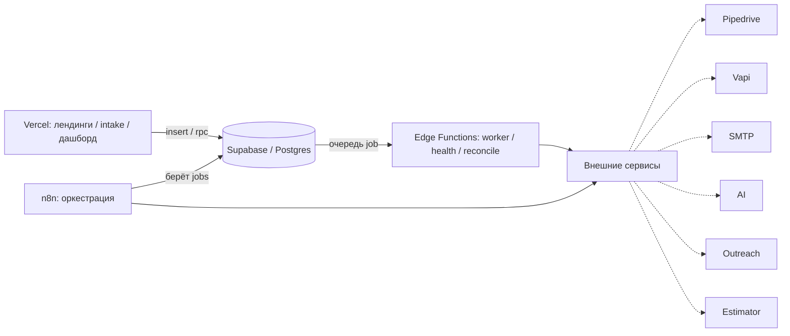

# 🧭 GRC — База знаний

> [!abstract] TL;DR
> Система автоматизации пути лида для сервисного бизнеса (ремонт/восстановление) на рынке США:
> **приём → обогащение → CRM → первое касание → outreach → AI-эстимейт.**
> Ключевая идея — **надёжная инфраструктура, а не happy-path**: идемпотентность, очередь с ретраями, dead-letter, реконсиляция, наблюдаемость. Лид не теряется никогда.

> [!info] Состояние
> 🟡 Старт / проектирование. Есть `PROJECT.md`, правила Cursor, `README.md`. Кода модулей пока нет.
> Репозиторий: [zobnin8-ux/GRC_WORK](https://github.com/zobnin8-ux/GRC_WORK)

---

## 🗺️ Карта проекта

- [[#🏗️ Архитектура]]
- [[#🔒 Инварианты]]
- [[#🧱 Модель данных]]
- [[#🧩 Модули]]
- [[#🔁 Поток лида]]
- [[#🔌 Интеграция estimator]]
- [[#🚧 План действий]]
- [[#❓ Открытые вопросы]]
- [[#📖 Глоссарий]]

---

## 🏗️ Архитектура

Четыре слоя с чётким разделением ответственности:

| Слой | Роль |
|---|---|
| **Vercel** | веб: лендинги, edge-приём лидов, дашборд (Next.js, TS strict) |
| **Supabase / Postgres** | несущая конструкция: состояние, очередь job, аудит, Edge Functions, `pg_cron`, `pgvector` |
| **n8n** | дирижёр оркестрации — вызывает внешние сервисы, **не хранит состояние** |
| **Внешние** | Pipedrive, Vapi, SMTP, OpenAI/Anthropic, Instantly/Smartlead, Telegram |

> [!note]
> Каждый шаг конвейера — атомарный **job** в очереди Supabase. n8n и Edge Functions только *исполняют* jobs; правда о состоянии — всегда в БД.



---

## 🔒 Инварианты

> [!danger] Нарушать нельзя
> 1. Состояние — в **Supabase**, не в n8n и не во фронте.
> 2. Каждая внешняя операция **идемпотентна** (детерминированный ключ → нет дублей).
> 3. **Отказ — норма**: ретраи с экспоненциальным backoff → dead-letter, не потеря.
> 4. **Приём лида терять нельзя** — точка входа простая и независимая.
> 5. **Секреты только в env vars** — никогда в коде, репозитории, логах.
> 6. **Наблюдаемость**: каждое исполнение → `job_runs`; пороги дашборда = пороги Telegram-алертов.

---

## 🧱 Модель данных

| Таблица | Назначение | Статусы |
|---|---|---|
| `leads` | канонические лиды, dedup по `idempotency_key` | `new → enriched → synced → contacted → orphaned \| dead` |
| `jobs` | очередь работ (шаг конвейера = job) | `pending → processing → done \| failed → dead` |
| `job_runs` | append-only аудит каждого исполнения | — |
| `health_checks` | состояние внешних сервисов (circuit breaker) | — |
| `reconciliation_log` | расхождения ночной сверки | — |

> [!tip] Идемпотентность на уровне БД
> Уникальные ограничения: `leads.idempotency_key`, `jobs (type, idempotency_key)`.
> Ключ лида: `md5(lower(email) || coalesce(phone,'') || source)`.
> Backoff: `next_run_at = now() + interval '30 seconds' * pow(2, attempts)`.

---

## 🧩 Модули

| Модуль | Что делает | Статус |
|---|---|---|
| **Intake** | приём → ключ → запись → enqueue | 🔼 приоритет, первым |
| **Enrich** | обогащение лида | после ядра |
| **CRM sync** | upsert в Pipedrive по `external_key` | после Enrich |
| **First-touch** | звонок (Vapi) / письмо + фиксация в CRM | после CRM |
| **Outreach** | холодные кампании, ответы → обратно в Intake | warmup с дня 1 |
| **Estimator** | расчёт стоимости — **свой estimator заказчика на Vercel** | ⏳ ждёт API-контракт |
| **Observability** | health-check, реконсиляция, дашборд, алерты | параллельно |

---

## 🔁 Поток лида

```
форма / outreach-ответ / vapi-inbound
        │
        ▼
[Intake]  insert lead (on conflict do nothing) ──▶ enqueue 'enrich'
        ▼
[Enrich]  обогащение ──▶ enqueue 'pipedrive_upsert'
        ▼
[CRM]     upsert по external_key ──▶ status=synced ──▶ enqueue 'first_touch'
        ▼
[First-touch]  vapi_call | send_email ──▶ status=contacted, результат в CRM
```

> [!warning] Saga / компенсации
> Провал на любом шаге → ретраи → при dead-letter лид помечается и попадает в `reconciliation_log`. Никакого «полусогласованного» состояния.

---

## 🔌 Интеграция estimator

> [!question] Контекст
> У заказчика **свой estimator, задеплоен на Vercel**. Мы не строим свой — интегрируемся по HTTP.

- Предпочтительно — серверный эндпоинт `POST /api/estimate` с авторизацией по токену.
- Вызов «сервер-сервер» по HTTPS, **не** через парсинг их фронтенда.
- Ляжет как внешний сервис за абстракцией: шаг `estimate` = job (ретраи, идемпотентность, аудит, circuit breaker).

> [!todo] Запросить у создателей estimator
> - [ ] URL эндпоинта (прод + staging)
> - [ ] Аутентификация (API-ключ / Bearer)
> - [ ] Формат запроса (поля, обязательные/опц., фото)
> - [ ] Формат ответа (сумма, диапазон, разбивка, валюта, срок) + ошибки
> - [ ] Sync или async (callback / polling) + время ответа
> - [ ] Поддержка `request_id` (idempotency)
> - [ ] Rate limit и таймауты

---

## 🚧 План действий

- [ ] **Этап 0 — фундамент:** каркас Next.js на Vercel, инициализация Supabase, `.env.example`
- [ ] **Этап 1 — ядро + Intake:** миграция схемы, `lib/idempotency.ts`, `app/api/intake`, worker очереди
- [ ] **Этап 2 — конвейер:** Enrich → CRM sync → First-touch, оркестрация в n8n, saga
- [ ] **Этап 3 — наблюдаемость:** функции `dash_*`, дашборд, `lib/alert.ts`, health-check + реконсиляция (`pg_cron`)
- [ ] **Этап 4 — расширения:** Outreach (Instantly/Smartlead), интеграция estimator заказчика

---

## ❓ Открытые вопросы

> [!question]
> - [ ] Есть ли спек `docs/grc-reliability-layer.md` (полный DDL) или проектируем с нуля?
> - [ ] Какой контракт API даст создатель estimator?
> - [ ] n8n — self-host или облако?
> - [ ] Нужно ли встраивать UI estimator (iframe/ссылка) или только получать расчёт?

---

## 📖 Глоссарий

| Термин | Значение |
|---|---|
| **job** | атомарная единица работы в очереди (один шаг конвейера) |
| **run** | одно исполнение job (их может быть несколько из-за ретраев) |
| **idempotency_key** | детерминированный ключ, гарантирующий отсутствие дублей |
| **dead-letter** | job, исчерпавший ретраи; не теряется, ждёт разбора |
| **saga** | цепочка шагов с компенсациями вместо общей транзакции |
| **first-touch** | первое касание лида (звонок или письмо) |
| **reconciliation** | сверка расхождений между системами |
| **circuit breaker** | приостановка вызовов к упавшему сервису до восстановления |

---

> [!cite] Источники правды
> - `PROJECT.md` — полный контекст
> - `README.md` — снимок состояния
> - `.cursor/rules/*.mdc` — правила для AI-ассистента
